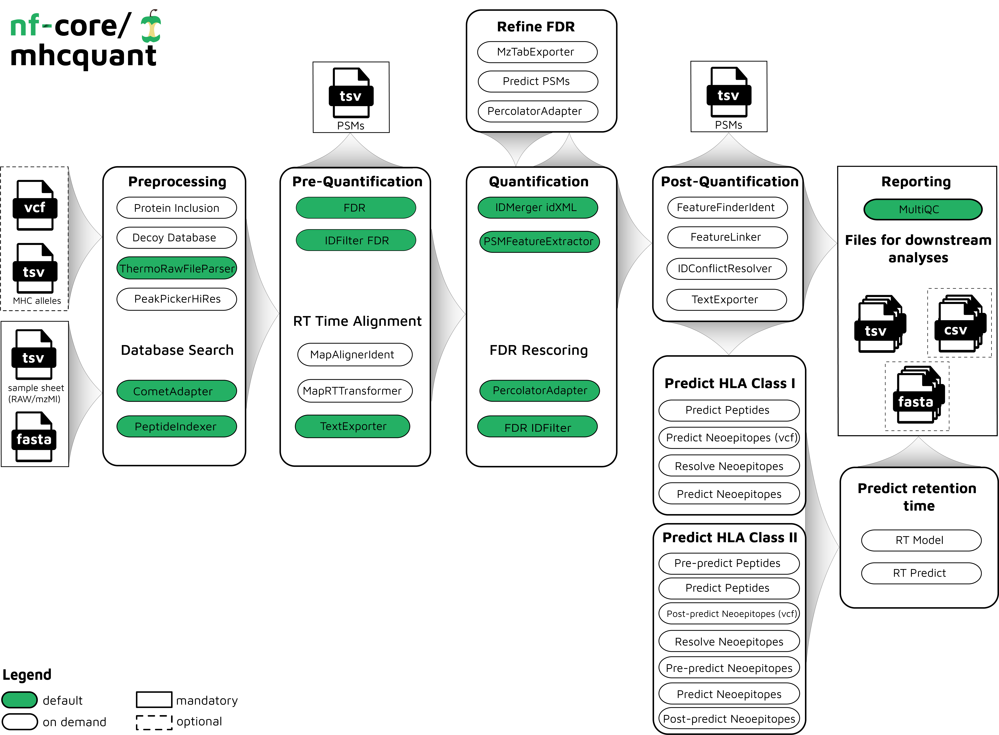

#  

[](https://nf-co.re/mhcquant/results)[](https://doi.org/10.5281/zenodo.1569909)

[](https://www.nextflow.io/)
[](https://docs.conda.io/en/latest/)
[](https://www.docker.com/)
[](https://sylabs.io/docs/)
[](https://tower.nf/launch?pipeline=https://github.com/nf-core/mhcquant)

[](https://nfcore.slack.com/channels/mhcquant)[](https://twitter.com/nf_core)[](https://mstdn.science/@nf_core)[](https://www.youtube.com/c/nf-core)

## Introduction

**nfcore/mhcquant** is a bioinformatics analysis pipeline used for quantitative processing of data dependent (DDA) peptidomics data.

It was specifically designed to analyse immunopeptidomics data, which deals with the analysis of affinity purified, unspecifically cleaved peptides that have recently been discussed intensively in [the context of cancer vaccines](https://www.nature.com/articles/ncomms13404).

The workflow is based on the OpenMS C++ framework for computational mass spectrometry. RAW files (mzML) serve as inputs and a database search (Comet) is performed based on a given input protein database. FDR rescoring is applied using Percolator based on a competitive target-decoy approach (reversed decoys). For label free quantification all input files undergo identification based retention time alignment (MapAlignerIdentification), and targeted feature extraction matching ids between runs (FeatureFinderIdentification). In addition, a variant calling file (vcf) can be specified to translate variants into proteins that will be included in the database search and binding predictions on specified alleles (alleles.tsv) using MHCFlurry (Class 1) or MHCNugget (Class 2) can be directly run on the output peptide lists. Moreover, if a vcf file was specified, neoepitopes will automatically be determined and binding predictions can also directly be predicted for them.

The pipeline is built using [Nextflow](https://www.nextflow.io), a workflow tool to run tasks across multiple compute infrastructures in a very portable manner. It uses Docker/Singularity containers making installation trivial and results highly reproducible. The [Nextflow DSL2](https://www.nextflow.io/docs/latest/dsl2.html) implementation of this pipeline uses one container per process which makes it much easier to maintain and update software dependencies. Where possible, these processes have been submitted to and installed from [nf-core/modules](https://github.com/nf-core/modules) in order to make them available to all nf-core pipelines, and to everyone within the Nextflow community!

On release, automated continuous integration tests run the pipeline on a full-sized dataset on the AWS cloud infrastructure. This ensures that the pipeline runs on AWS, has sensible resource allocation defaults set to run on real-world datasets, and permits the persistent storage of results to benchmark between pipeline releases and other analysis sources. The results obtained from the full-sized test can be viewed on the [nf-core website](https://nf-co.re/mhcquant/results).



## Usage

> **Note**
> If you are new to Nextflow and nf-core, please refer to [this page](https://nf-co.re/docs/usage/installation) on how
> to set-up Nextflow. Make sure to [test your setup](https://nf-co.re/docs/usage/introduction#how-to-run-a-pipeline)
> with `-profile test` before running the workflow on actual data.

<!-- TODO nf-core: Describe the minimum required steps to execute the pipeline, e.g. how to prepare samplesheets.
     Explain what rows and columns represent. For instance (please edit as appropriate):

First, prepare a samplesheet with your input data that looks as follows:

`samplesheet.csv`:

```csv
sample,fastq_1,fastq_2
CONTROL_REP1,AEG588A1_S1_L002_R1_001.fastq.gz,AEG588A1_S1_L002_R2_001.fastq.gz
```

Each row represents a fastq file (single-end) or a pair of fastq files (paired end).

-->

Now, you can run the pipeline using:

<!-- TODO nf-core: update the following command to include all required parameters for a minimal example -->

```bash
nextflow run nf-core/mhcquant \
   -profile <docker/singularity/.../institute> \
   --input samplesheet.csv \
   --outdir <OUTDIR>
```

> **Warning:**
> Please provide pipeline parameters via the CLI or Nextflow `-params-file` option. Custom config files including those
> provided by the `-c` Nextflow option can be used to provide any configuration _**except for parameters**_;
> see [docs](https://nf-co.re/usage/configuration#custom-configuration-files).

For more details and further functionality, please refer to the [usage documentation](https://nf-co.re/mhcquant/usage) and the [parameter documentation](https://nf-co.re/mhcquant/parameters).

## Pipeline output

=======

```bash
nextflow run nf-core/mhcquant -profile test,<docker/singularity/podman/shifter/charliecloud/conda/institute> \
                              --input 'samples.tsv' \
                              --fasta 'SWISSPROT_2020.fasta' \
                              --outdir ./results
```

## Pipeline summary

### Default Steps

By default the pipeline currently performs the following

#### Identification

- Identification of peptides in the MS/MS spectra using Comet (`CometAdapter`)
- Refreshes the protein references for all peptide hits and adds target/decoy information (`PeptideIndexer`)
- Filters peptide/protein identification results on ID based alignment (`IDFilter`)
- Merges idXML files of a sample-condition group into one idXML file (`IDMerger`)
- Defines extra features for Percolator (`PSMFeatureExtractor`)
- Facilitates the input to, the call of and output integration of Percolator (`PercolatorAdapter`)
- Filters peptide/protein identification result based on Percolator q-value (`IDFilter`)
- Splits merged idXML file into their respective runs again (`IDRipper`)
- Uses Comet XCorr instead of percolator q-value as primary score for downstream purposess (`IDScoreSwitcher`)
- Keeps peptides observed after FDR filtering in each run and selects the best peptide per run (`Pyopenms_IDFilter`)

#### Map alignment

- Corrects retention time distortions between runs, using information from peptides identified in different runs (`MapAlignerIdentification`)
- Applies retention time transformations to runs (`MapRTTransformer`)

#### Process features

- Detects features in MS1 data based on peptide identifications (`FeatureFinderIdentification`)
- Group corresponding features across labelfree experiments (`FeatureLinkerUnlabeledKD`)
- Resolves ambiguous annotations of features with peptide identifications (`IDConflictResolver`)

#### Output

- Converts XML format to text files (`TextExporter`)
- Converts XML format to mzTab files (`MzTabExporter`)

### Additional Steps

Additional functionality contained by the pipeline currently includes:

#### Input

- Inclusion of proteins in the reference database (`mhcnuggets`, `mhcflurry`, `fred2`)
- Create a decoy peptide database from standard FASTA databases (`DecoyDatabase`)
- Conversion of raw to mzML files (`ThermoRawFileParser`)
- Conversion of tdf (`.d`) to mzML files (`tdf2mzml`)
- Executing the peak picking with high_res algorithm (`PeakPickerHiRes`)

#### Additional features for rescoring

- Retention time prediction (`DeepLC`)
- Peak intensity prediction (`MS2PIP`)

#### Refine FDR

- This application converts several OpenMS XML formats to mzTab. (`MzTabExporter`)
- Predict psm results using mhcflurry to shrink search space (`mhcflurry`)
- Facilitates the input to, the call of and output integration of Percolator (`PercolatorAdapter`)

#### Prediction of HLA class 1 peptides

- Predict peptides (`mhcnuggets`, `mhcflurry`, `fred2`)
- Predict possible neoepitopes - when an vcf files is provided (`mhcnuggets`, `mhcflurry`, `fred2`)
- Predict neoepitopes based on the peptide hits (`mhcnuggets`, `mhcflurry`, `fred2`)
- Resolve found neoepitopes (`mhcnuggets`, `mhcflurry`, `fred2`)

#### Output

- Annotates final list of peptides with their respective ions and charges (`IonAnnotator`)

## Documentation

> > > > > > > dev

To see the the results of a test run with a full size dataset refer to the [results](https://nf-co.re/mhcquant/results) tab on the nf-core website pipeline page.
For more details about the output files and reports, please refer to the
[output documentation](https://nf-co.re/mhcquant/output).

1. [Nextflow installation](https://nf-co.re/usage/installation)
2. Pipeline configuration
   - [Pipeline installation](https://nf-co.re/usage/local_installation)
   - [Adding your own system config](https://nf-co.re/usage/adding_own_config)
3. [Running the pipeline](https://nf-co.re/mhcquant/docs/usage.md)
   - This includes tutorials, FAQs, and troubleshooting instructions
4. [Output and how to interpret the results](https://nf-co.re/mhcquant/docs/output.md)

## Credits

nf-core/mhcquant was originally written by [Leon Bichmann](https://github.com/Leon-Bichmann) from the [Kohlbacher Lab](https://kohlbacherlab.org/). The pipeline was re-written in Nextflow DSL2 and is primarily maintained by [Marissa Dubbelaar](https://github.com/marissaDubbelaar) and [Jonas Scheid](https://github.com/jonasscheid) from [Peptide-based Immunotherapy](https://www.medizin.uni-tuebingen.de/en-de/peptid-basierte-immuntherapie) and [Quantitative Biology Center](https://uni-tuebingen.de/forschung/forschungsinfrastruktur/zentrum-fuer-quantitative-biologie-qbic/) in Tübingen.

Helpful contributors:

- [Lukas Heumos](https://github.com/Zethson)
- [Alexander Peltzer](https://github.com/apeltzer)
- [Maxime Garcia](https://github.com/maxulysse)
- [Gisela Gabernet](https://github.com/ggabernet)
- [Susanne Jodoin](https://github.com/SusiJo)
- [Oskar Wacker](https://github.com/WackerO)
- [Leon Kuchenbecker](https://github.com/lkuchenb)
- [Phil Ewels](https://github.com/ewels)
- [Christian Fufezan](https://github.com/fu)
- [Sven Fillinger](https://github.com/sven1103)
- [Kevin Menden](https://github.com/KevinMenden)
- [Steffen Lemke](https://github.com/steffenlem)

## Contributions and Support

If you would like to contribute to this pipeline, please see the [contributing guidelines](.github/CONTRIBUTING.md).

For further information or help, don't hesitate to get in touch on the [Slack `#mhcquant` channel](https://nfcore.slack.com/channels/mhcquant) (you can join with [this invite](https://nf-co.re/join/slack)).

## Citations

If you use nf-core/mhcquant for your analysis, please cite it using the following doi: [10.5281/zenodo.1569909](https://doi.org/10.5281/zenodo.1569909) and the corresponding manuscript:

> **MHCquant: Automated and Reproducible Data Analysis for Immunopeptidomics**
>
> Leon Bichmann, Annika Nelde, Michael Ghosh, Lukas Heumos, Christopher Mohr, Alexander Peltzer, Leon Kuchenbecker, Timo Sachsenberg, Juliane S. Walz, Stefan Stevanović, Hans-Georg Rammensee & Oliver Kohlbacher
>
> _Journal of Proteome Research_ 2019 18 (11), 3876-3884. doi: [10.1021/acs.jproteome.9b00313](https://pubs.acs.org/doi/10.1021/acs.jproteome.9b00313)

An extensive list of references for the tools used by the pipeline can be found in the [`CITATIONS.md`](CITATIONS.md) file.

You can cite the `nf-core` publication as follows:

> **The nf-core framework for community-curated bioinformatics pipelines.**
>
> Philip Ewels, Alexander Peltzer, Sven Fillinger, Harshil Patel, Johannes Alneberg, Andreas Wilm, Maxime Ulysse Garcia, Paolo Di Tommaso & Sven Nahnsen.
>
> _Nat Biotechnol._ 2020 Feb 13. doi: [10.1038/s41587-020-0439-x](https://dx.doi.org/10.1038/s41587-020-0439-x).

In addition, references of tools and data used in this pipeline are as follows:

> **Fred2 Immunoinformatics Toolbox**
>
> Schubert B. et al, _Bioinformatics_ 2016 Jul 1;32(13):2044-6. doi: [10.1093/bioinformatics/btw113](https://academic.oup.com/bioinformatics/article/32/13/2044/1743767). Epub 2016 Feb 26
>
> **Comet Search Engine**
>
> Eng J.K. et al, _J Am Soc Mass Spectrom._ 2015 Nov;26(11):1865-74. doi: [10.1007/s13361-015-1179-x](https://pubs.acs.org/doi/10.1007/s13361-015-1179-x). Epub 2015 Jun 27.
>
> **Percolator**
>
> Käll L. et al, _Nat Methods_ 2007 Nov;4(11):923-5. doi: [10.1038/nmeth1113](https://www.nature.com/articles/nmeth1113). Epub 2007 Oct 21.
>
> **Retention time prediction**
>
> Bouwmeester R. et al, _Nature Methods_ 2021 Oct;18(11):1363-1369. doi: [10.1038/s41592-021-01301-5](https://www.nature.com/articles/s41592-021-01301-5)
>
> **MS2 Peak intensity prediction**
>
> Gabriels R. et al, _Nucleic Acids Research_ 2019 Jul;47(W1):W295-9. doi: [10.1038/s41592-021-01301-5](https://academic.oup.com/nar/article/47/W1/W295/5480903)
>
> **Identification based RT Alignment**
>
> Weisser H. et al, _J Proteome Res._ 2013 Apr 5;12(4):1628-44. doi: [10.1021/pr300992u](https://pubs.acs.org/doi/10.1021/pr300992u). Epub 2013 Feb 22.
>
> **Targeted peptide quantification**
>
> Weisser H. et al, _J Proteome Res._ 2017 Aug 4;16(8):2964-2974. doi: [10.1021/acs.jproteome.7b00248](https://pubs.acs.org/doi/10.1021/acs.jproteome.7b00248). Epub 2017 Jul 19.
>
> **MHC affinity prediction**
>
> O'Donnell T.J., _Cell Syst._ 2018 Jul 25;7(1):129-132.e4. doi: [10.1016/j.cels.2018.05.014](https://www.sciencedirect.com/science/article/pii/S2405471218302321). Epub 2018 Jun 27.
>
> Shao X.M., _Cancer Immunol Res._ 2020 Mar;8(3):396-408. doi: [10.1158/2326-6066.CIR-19-0464](https://aacrjournals.org/cancerimmunolres/article/8/3/396/469597/High-Throughput-Prediction-of-MHC-Class-I-and-II). Epub 2019 Dec 23.
