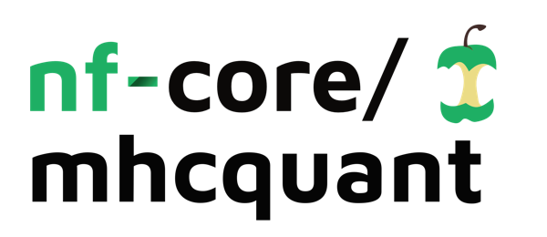
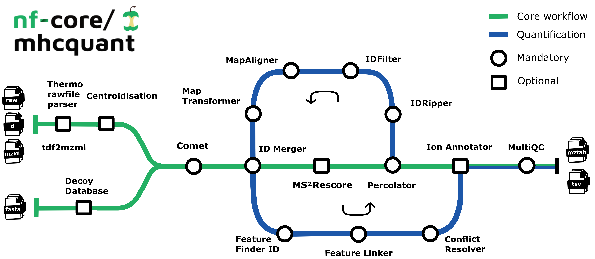

<h1>
  <picture>
    <source media="(prefers-color-scheme: dark)" srcset="docs/images/nf-core-mhcquant_logo_dark.png">
    
  </picture>
</h1>

[](https://github.com/nf-core/mhcquant/actions/workflows/ci.yml)
[](https://github.com/nf-core/mhcquant/actions/workflows/linting.yml)[](https://nf-co.re/mhcquant/results)[](https://doi.org/10.5281/zenodo.8427707)
[](https://www.nf-test.com)

[](https://www.nextflow.io/)
[](https://docs.conda.io/en/latest/)
[](https://www.docker.com/)
[](https://sylabs.io/docs/)
[](https://cloud.seqera.io/launch?pipeline=https://github.com/nf-core/mhcquant)

[](https://nfcore.slack.com/channels/mhcquant)[](https://twitter.com/nf_core)[](https://mstdn.science/@nf_core)[](https://www.youtube.com/c/nf-core)

## Introduction

**nfcore/mhcquant** is a best-practice bioinformatics pipeline to process data-dependent acquisition (DDA) immunopeptidomics data. This involves mass spectrometry-based identification and quantification of immunopeptides presented on major histocompatibility complex (MHC) molecules which mediate T cell immunosurveillance. Immunopeptidomics has central implications for clinical research, in the context of [T cell-centric immunotherapies](https://www.sciencedirect.com/science/article/pii/S1044532323000180).

The pipeline is based on the OpenMS C++ framework for computational mass spectrometry. Spectrum files (mzML/Thermo raw/Bruker tdf) serve as inputs and a database search (Comet) is performed based on a given input protein database. Peptide properties are predicted by MS²Rescore. FDR rescoring is applied using Percolator based on a competitive target-decoy approach. For label free quantification all input files undergo identification-based retention time alignment, and targeted feature extraction matching ids between runs.



The pipeline is built using [Nextflow](https://www.nextflow.io), a workflow tool to run tasks across multiple compute infrastructures in a very portable manner. It uses Docker/Singularity containers making installation trivial and results highly reproducible. The [Nextflow DSL2](https://www.nextflow.io/docs/latest/dsl2.html) implementation of this pipeline uses one container per process which makes it much easier to maintain and update software dependencies. Where possible, these processes have been submitted to and installed from [nf-core/modules](https://github.com/nf-core/modules) in order to make them available to all nf-core pipelines, and to everyone within the Nextflow community!

On release, automated continuous integration tests run the pipeline on a full-sized dataset on the AWS cloud infrastructure. This ensures that the pipeline runs on AWS, has sensible resource allocation defaults set to run on real-world datasets, and permits the persistent storage of results to benchmark between pipeline releases and other analysis sources. The results obtained from the full-sized test can be viewed on the [nf-core website](https://nf-co.re/mhcquant/results).

## Usage

> [!NOTE]
> If you are new to Nextflow and nf-core, please refer to [this page](https://nf-co.re/docs/usage/installation) on how
> to set-up Nextflow. Make sure to [test your setup](https://nf-co.re/docs/usage/introduction#how-to-run-a-pipeline)
> with `-profile test` before running the workflow on actual data.

First, prepare a samplesheet with your input data that looks as follows:

`samplesheet.tsv`

```tsv title="samplesheet.tsv
ID	Sample	Condition	ReplicateFileName
1	tumor	treated	/path/to/msrun1.raw|mzML|d
2	tumor	treated	/path/to/msrun2.raw|mzML|d
3	tumor	untreated	/path/to/msrun3.raw|mzML|d
4	tumor	untreated	/path/to/msrun4.raw|mzML|d
```

Each row represents a mass spectrometry run in one of the formats: raw, RAW, mzML, mzML.gz, d, d.tar.gz, d.zip

Now, you can run the pipeline using:

```bash
nextflow run nf-core/mhcquant
    -profile <docker/singularity/.../institute> \
    --input 'samplesheet.tsv' \
    --fasta 'SWISSPROT_2020.fasta' \
    --outdir ./results
```

> [!WARNING]
> Please provide pipeline parameters via the CLI or Nextflow `-params-file` option. Custom config files including those provided by the `-c` Nextflow option can be used to provide any configuration _**except for parameters**_;
> see [docs](https://nf-co.re/usage/configuration#custom-configuration-files).

For more details and further functionality, please refer to the [usage documentation](https://nf-co.re/mhcquant/usage) and the [parameter documentation](https://nf-co.re/mhcquant/parameters).

## Pipeline summary

### Default Steps

By default the pipeline currently performs identification of MHC class I peptides with HCD settings:

- Preparing spectra dependent on the input format (`PrepareSpectra`)
- Creation of reversed decoy database (`DecoyDatabase`)
- Identification of peptides in the MS/MS spectra (`CometAdapter`)
- Refreshes the protein references for all peptide hits and adds target/decoy information (`PeptideIndexer`)
- Merges identification files with the same `Sample` and `Condition` label (`IDMerger`)
- Prediction of retention times and MS2 intensities (`MS²Rescore`)
- Extract PSM features for Percolator (`PSMFeatureExtractor`)
- Peptide-spectrum-match rescoring using Percolator (`PercolatorAdapter`)
- Filters peptide identification result according to 1\% FDR (`IDFilter`)
- Converts identification result to tab-separated files (`TextExporter`)
- Converts identification result to mzTab files (`MzTabExporter`)

### Additional Steps

Additional functionality contained by the pipeline currently includes:

#### Quantification

- Corrects retention time distortions between runs (`MapAlignerIdentification`)
- Applies retention time transformations to runs (`MapRTTransformer`)
- Detects features in MS1 data based on peptide identifications (`FeatureFinderIdentification`)
- Group corresponding features across label-free experiments (`FeatureLinkerUnlabeledKD`)
- Resolves ambiguous annotations of features with peptide identifications (`IDConflictResolver`)

#### Output

- Annotates final list of peptides with their respective ions and charges (`IonAnnotator`)

## Documentation

To see the the results of a test run with a full size dataset refer to the [results](https://nf-co.re/mhcquant/results) tab on the nf-core website pipeline page.
For more details about the output files and reports, please refer to the
[output documentation](https://nf-co.re/mhcquant/output).

1. [Nextflow installation](https://nf-co.re/usage/installation)
2. Pipeline configuration
   - [Pipeline installation](https://nf-co.re/usage/local_installation)
   - [Adding your own system config](https://nf-co.re/usage/adding_own_config)
3. [Running the pipeline](https://nf-co.re/mhcquant/docs/usage.md)
   - This includes tutorials, FAQs, and troubleshooting instructions
4. [Output and how to interpret the results](https://nf-co.re/mhcquant/docs/output.md)

## Credits

nf-core/mhcquant was originally written by [Leon Bichmann](https://github.com/Leon-Bichmann) from the [Kohlbacher Lab](https://kohlbacherlab.org/). The pipeline was re-written in Nextflow DSL2 by [Marissa Dubbelaar](https://github.com/marissaDubbelaar) and was significantly improved by [Jonas Scheid](https://github.com/jonasscheid) and [Steffen Lemke](https://github.com/steffenlem) from [Peptide-based Immunotherapy](https://www.medizin.uni-tuebingen.de/en-de/peptid-basierte-immuntherapie) and [Quantitative Biology Center](https://uni-tuebingen.de/forschung/forschungsinfrastruktur/zentrum-fuer-quantitative-biologie-qbic/) in Tübingen.

Helpful contributors:

- [Lukas Heumos](https://github.com/Zethson)
- [Alexander Peltzer](https://github.com/apeltzer)
- [Maxime Garcia](https://github.com/maxulysse)
- [Gisela Gabernet](https://github.com/ggabernet)
- [Susanne Jodoin](https://github.com/SusiJo)
- [Oskar Wacker](https://github.com/WackerO)
- [Leon Kuchenbecker](https://github.com/lkuchenb)
- [Phil Ewels](https://github.com/ewels)
- [Christian Fufezan](https://github.com/fu)
- [Sven Fillinger](https://github.com/sven1103)
- [Kevin Menden](https://github.com/KevinMenden)

## Contributions and Support

If you would like to contribute to this pipeline, please see the [contributing guidelines](.github/CONTRIBUTING.md).

For further information or help, don't hesitate to get in touch on the [Slack `#mhcquant` channel](https://nfcore.slack.com/channels/mhcquant) (you can join with [this invite](https://nf-co.re/join/slack)).

## Citations

If you use nf-core/mhcquant for your analysis, please cite it using the following doi: [10.5281/zenodo.1569909](https://doi.org/10.5281/zenodo.1569909) and the corresponding manuscript:

> **MHCquant: Automated and Reproducible Data Analysis for Immunopeptidomics**
>
> Leon Bichmann, Annika Nelde, Michael Ghosh, Lukas Heumos, Christopher Mohr, Alexander Peltzer, Leon Kuchenbecker, Timo Sachsenberg, Juliane S. Walz, Stefan Stevanović, Hans-Georg Rammensee & Oliver Kohlbacher
>
> _Journal of Proteome Research_ 2019 18 (11), 3876-3884. doi: [10.1021/acs.jproteome.9b00313](https://pubs.acs.org/doi/10.1021/acs.jproteome.9b00313)

An extensive list of references for the tools used by the pipeline can be found in the [`CITATIONS.md`](CITATIONS.md) file.

You can cite the `nf-core` publication as follows:

> **The nf-core framework for community-curated bioinformatics pipelines.**
>
> Philip Ewels, Alexander Peltzer, Sven Fillinger, Harshil Patel, Johannes Alneberg, Andreas Wilm, Maxime Ulysse Garcia, Paolo Di Tommaso & Sven Nahnsen.
>
> _Nat Biotechnol._ 2020 Feb 13. doi: [10.1038/s41587-020-0439-x](https://dx.doi.org/10.1038/s41587-020-0439-x).

In addition, references of tools and data used in this pipeline are as follows:

> **OpenMS framework**
>
> Pfeuffer J. et al, _Nat Methods_ 2024 Mar;21(3):365-367. doi: [0.1038/s41592-024-02197-7](https://www.nature.com/articles/s41592-024-02197-7).
>
> **Comet Search Engine**
>
> Eng J.K. et al, _J Am Soc Mass Spectrom._ 2015 Nov;26(11):1865-74. doi: [10.1007/s13361-015-1179-x](https://pubs.acs.org/doi/10.1007/s13361-015-1179-x).
>
> **Retention time prediction**
>
> Bouwmeester R. et al, _Nature Methods_ 2021 Oct;18(11):1363-1369. doi: [10.1038/s41592-021-01301-5](https://www.nature.com/articles/s41592-021-01301-5)
>
> **MS² Peak intensity prediction**
>
> Declercq A. et al, _Nucleic Acids Res._ 2023 Jul 5;51(W1):W338-W342. doi: [10.1093/nar/gkad335](https://academic.oup.com/nar/article/51/W1/W338/7151340?login=false)
>
> **MS²Rescore framework**
>
> Buur L. M. et al, \_J Proteome Res. 2024 Mar 16. doi: [10.1021/acs.jproteome.3c00785](https://pubs.acs.org/doi/10.1021/acs.jproteome.3c00785)
>
> **Percolator**
>
> Käll L. et al, _Nat Methods_ 2007 Nov;4(11):923-5. doi: [10.1038/nmeth1113](https://www.nature.com/articles/nmeth1113).
>
> **Identification based RT Alignment**
>
> Weisser H. et al, _J Proteome Res._ 2013 Apr 5;12(4):1628-44. doi: [10.1021/pr300992u](https://pubs.acs.org/doi/10.1021/pr300992u)
>
> **Targeted peptide quantification**
>
> Weisser H. et al, _J Proteome Res._ 2017 Aug 4;16(8):2964-2974. doi: [10.1021/acs.jproteome.7b00248](https://pubs.acs.org/doi/10.1021/acs.jproteome.7b00248)
