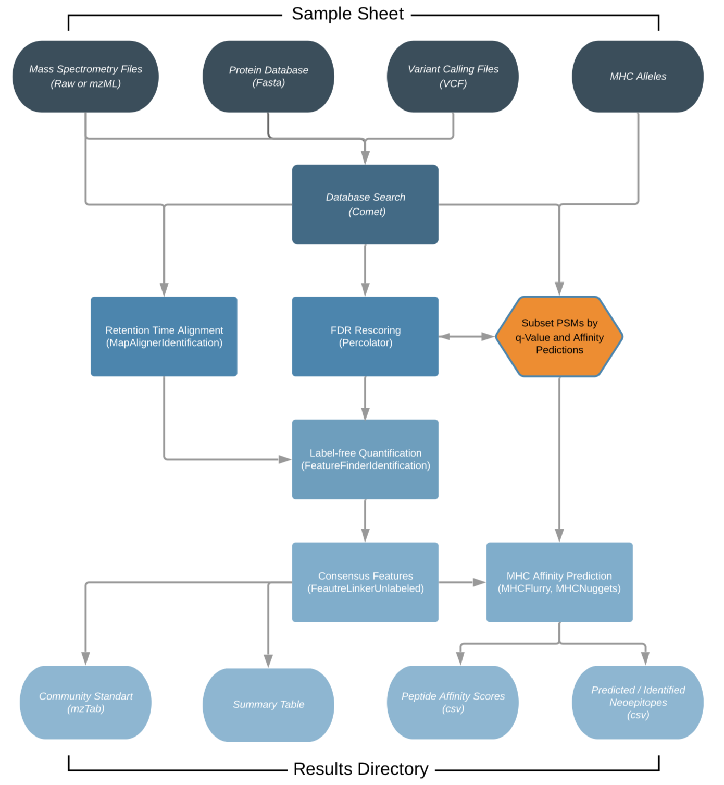

# 

[](https://github.com/nf-core/mhcquant/actions?query=workflow%3A%22nf-core+CI%22)
[](https://github.com/nf-core/mhcquant/actions?query=workflow%3A%22nf-core+linting%22)
[](https://nf-co.re/mhcquant/results)
[](https://doi.org/10.5281/zenodo.1400710)

[](https://www.nextflow.io/)
[](https://docs.conda.io/en/latest/)
[](https://www.docker.com/)
[](https://sylabs.io/docs/)

[](https://nfcore.slack.com/channels/mhcquant)
[](https://twitter.com/nf_core)
[](https://www.youtube.com/c/nf-core)

## Introduction

**nfcore/mhcquant** is a bioinformatics analysis pipeline used for quantitative processing of data dependent (DDA) peptidomics data.

It was specifically designed to analyse immunopeptidomics data, which deals with the analysis of affinity purified, unspecifically cleaved peptides that have recently been discussed intensively in [the context of cancer vaccines](https://www.nature.com/articles/ncomms13404).

The workflow is based on the OpenMS C++ framework for computational mass spectrometry. RAW files (mzML) serve as inputs and a database search (Comet) is performed based on a given input protein database. FDR rescoring is applied using Percolator based on a competitive target-decoy approach (reversed decoys). For label free quantification all input files undergo identification based retention time alignment (MapAlignerIdentification), and targeted feature extraction matching ids between runs (FeatureFinderIdentification). In addition, a variant calling file (vcf) can be specified to translate variants into proteins that will be included in the database search and binding predictions on specified alleles (alleles.tsv) using MHCFlurry (Class 1) or MHCNugget (Class 2) can be directly run on the output peptide lists. Moreover, if a vcf file was specified, neoepitopes will automatically be determined and binding predictions can also directly be predicted for them.

The pipeline is built using [Nextflow](https://www.nextflow.io), a workflow tool to run tasks across multiple compute infrastructures in a very portable manner. It uses Docker/Singularity containers making installation trivial and results highly reproducible. The [Nextflow DSL2](https://www.nextflow.io/docs/latest/dsl2.html) implementation of this pipeline uses one container per process which makes it much easier to maintain and update software dependencies. Where possible, these processes have been submitted to and installed from [nf-core/modules](https://github.com/nf-core/modules) in order to make them available to all nf-core pipelines, and to everyone within the Nextflow community!

On release, automated continuous integration tests run the pipeline on a full-sized dataset on the AWS cloud infrastructure. This ensures that the pipeline runs on AWS, has sensible resource allocation defaults set to run on real-world datasets, and permits the persistent storage of results to benchmark between pipeline releases and other analysis sources. The results obtained from the full-sized test can be viewed on the [nf-core website](https://nf-co.re/mhcquant/results).

## Pipeline summary

1. Read QC ([`FastQC`](https://www.bioinformatics.babraham.ac.uk/projects/fastqc/))
2. Present QC for raw reads ([`MultiQC`](http://multiqc.info/))


(This chart was created with the help of [Lucidchart](https://www.lucidchart.com))

## Quick Start

1. Install [`Nextflow`](https://www.nextflow.io/docs/latest/getstarted.html#installation) (`>=21.04.0`)

2. Install any of [`Docker`](https://docs.docker.com/engine/installation/), [`Singularity`](https://www.sylabs.io/guides/3.0/user-guide/), [`Podman`](https://podman.io/), [`Shifter`](https://nersc.gitlab.io/development/shifter/how-to-use/) or [`Charliecloud`](https://hpc.github.io/charliecloud/) for full pipeline reproducibility _(please only use [`Conda`](https://conda.io/miniconda.html) as a last resort; see [docs](https://nf-co.re/usage/configuration#basic-configuration-profiles))_.

3. Download the pipeline and test it on a minimal dataset with a single command:

    ```console
    nextflow run nf-core/mhcquant -profile test,<docker/singularity/podman/shifter/charliecloud/conda/institute>
    ```

    > * Please check [nf-core/configs](https://github.com/nf-core/configs#documentation) to see if a custom config file to run nf-core pipelines already exists for your Institute. If so, you can simply use `-profile <institute>` in your command. This will enable either `docker` or `singularity` and set the appropriate execution settings for your local compute environment.
    > * If you are using `singularity` then the pipeline will auto-detect this and attempt to download the Singularity images directly as opposed to performing a conversion from Docker images. If you are persistently observing issues downloading Singularity images directly due to timeout or network issues then please use the `--singularity_pull_docker_container` parameter to pull and convert the Docker image instead. Alternatively, it is highly recommended to use the [`nf-core download`](https://nf-co.re/tools/#downloading-pipelines-for-offline-use) command to pre-download all of the required containers before running the pipeline and to set the [`NXF_SINGULARITY_CACHEDIR` or `singularity.cacheDir`](https://www.nextflow.io/docs/latest/singularity.html?#singularity-docker-hub) Nextflow options to be able to store and re-use the images from a central location for future pipeline runs.
    > * If you are using `conda`, it is highly recommended to use the [`NXF_CONDA_CACHEDIR` or `conda.cacheDir`](https://www.nextflow.io/docs/latest/conda.html) settings to store the environments in a central location for future pipeline runs.

4. Start running your own analysis!

    ```bash
    nextflow run nf-core/mhcquant -profile test,<docker/singularity/podman/shifter/charliecloud/conda/institute>
                                  --input 'samples.tsv'
                                  --fasta 'SWISSPROT_2020.fasta'
                                  --allele_sheet 'alleles.tsv'
                                  --predict_class_1
                                  --refine_fdr_on_predicted_subset
    ```

See [usage docs](https://nf-co.re/mhcquant/usage) for all of the available options when running the pipeline.

## Pipeline Summary

By default, the pipeline currently performs the following:

* Protein database addition by mutated genome variants (`Fred2 Immunoinformatics Toolbox`)
* Database search ('Comet')
* False discovery rate estimation ('Percolator')
* Retention time alignment ('OpenMS-MapAlignerIdentification')
* Targeted peptide quantification ('OpenMS-FeatureFinderIdentification')
* MHC peptide affinity prediction ('MHCFlurry','MHCNuggets')

## Documentation

The nf-core/mhcquant pipeline comes with documentation about the pipeline: [usage](https://nf-co.re/mhcquant/usage) and [output](https://nf-co.re/mhcquant/output).

## Credits

We thank the following people for their extensive assistance in the development
of this pipeline:

* Leon Bichmann (@Leon-Bichmann)
* Lukas Heumos (@Zethson)
* Alexander Peltzer (@apeltzer)

The pipeline was converted to Nextflow DSL2 by Marissa Dubbelaar (@marissaDubbelaar)

## Contributions and Support

If you would like to contribute to this pipeline, please see the [contributing guidelines](.github/CONTRIBUTING.md).

For further information or help, don't hesitate to get in touch on the [Slack `#mhcquant` channel](https://nfcore.slack.com/channels/mhcquant) (you can join with [this invite](https://nf-co.re/join/slack)).

## Citations

If you use `nf-core/mhcquant` for your analysis, please cite it using the following doi: [10.5281/zenodo.5407955](https://doi.org/10.5281/zenodo.5407955) and the corresponding manuscript:

> **MHCquant: Automated and Reproducible Data Analysis for Immunopeptidomics**
>
> Leon Bichmann, Annika Nelde, Michael Ghosh, Lukas Heumos, Christopher Mohr, Alexander Peltzer, Leon Kuchenbecker, Timo Sachsenberg, Juliane S. Walz, Stefan Stevanović, Hans-Georg Rammensee & Oliver Kohlbacher
>
> Journal of Proteome Research 2019 18 (11), 3876-3884
> DOI: 10.1021/acs.jproteome.9b00313

An extensive list of references for the tools used by the pipeline can be found in the [`CITATIONS.md`](CITATIONS.md) file.

You can cite the `nf-core` publication as follows:

> **The nf-core framework for community-curated bioinformatics pipelines.**
>
> Philip Ewels, Alexander Peltzer, Sven Fillinger, Harshil Patel, Johannes Alneberg, Andreas Wilm, Maxime Ulysse Garcia, Paolo Di Tommaso & Sven Nahnsen.
>
> _Nat Biotechnol._ 2020 Feb 13. doi: [10.1038/s41587-020-0439-x](https://dx.doi.org/10.1038/s41587-020-0439-x).

In addition, references of tools and data used in this pipeline are as follows:

> **Fred2 Immunoinformatics Toolbox**
>
> Schubert B. et al, _Bioinformatics_ 2016 Jul 1;32(13):2044-6. doi: 10.1093/bioinformatics/btw113. Epub 2016 Feb 26
>
> **Comet Search Engine**
>
> Eng J.K. et al, _J Am Soc Mass Spectrom._ 2015 Nov;26(11):1865-74. doi: 10.1007/s13361-015-1179-x. Epub 2015 Jun 27.
>
> **Percolator**
>
> Käll L. et al, _Nat Methods_ 2007 Nov;4(11):923-5. doi: 10.1038/nmeth1113. Epub 2007 Oct 21.
>
> **Identification based RT Alignment**
>
> Weisser H. et al, _J Proteome Res._ 2013 Apr 5;12(4):1628-44. doi: 10.1021/pr300992u. Epub 2013 Feb 22.
>
> **Targeted peptide quantification**
>
> Weisser H. et al, _J Proteome Res._ 2017 Aug 4;16(8):2964-2974. doi: 10.1021/acs.jproteome.7b00248. Epub 2017 Jul 19.
>
> **MHC affinity prediction**
>
> O'Donnell T.J., _Cell Syst._ 2018 Jul 25;7(1):129-132.e4. doi: 10.1016/j.cels.2018.05.014. Epub 2018 Jun 27.
>
> Shao X.M., _Cancer Immunol Res._ 2020 Mar;8(3):396-408. doi: 10.1158/2326-6066.CIR-19-0464. Epub 2019 Dec 23.
